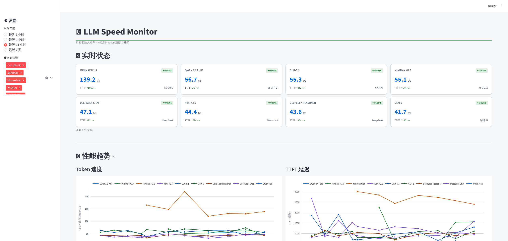

# LLM Speed Monitor

实时监控多家大模型服务商的 API 性能，包括 Token 生成速度和响应延迟。



## 功能

- 实时监控：定时测试各模型 API 的响应速度
- 趋势分析：查看历史性能数据变化趋势
- 性能排行：对比不同服务商的性能表现
- 多服务商支持：支持所有 OpenAI 兼容的 API

## 快速开始

### 1. 配置 API Keys

```bash
cp .env.example .env
# 编辑 .env 文件，填入你的 API Keys
```

### 2. 启动服务

启动脚本会自动安装依赖：

```bash
# Streamlit 前端（默认）
./start.sh

# Next.js 前端
./start.sh nextjs

# 仅后端（API + 采集器）
./start.sh backend

# 两种前端都启动
./start.sh all
```

## 当前监控模型

| 厂商 | 模型 |
|------|------|
| DeepSeek | DeepSeek Chat、DeepSeek Reasoner |
| 智谱 AI | GLM-5、GLM-5.1 |
| Moonshot | Kimi K2.5 |

## 配置说明

### config.yaml

```yaml
collector:
  interval_minutes: 1       # 采集间隔（分钟）
  timeout_seconds: 60       # API 超时时间
  test_prompt: "..."        # 测试用的 prompt
  max_tokens: 100           # 最大生成 token 数

providers:
  - name: deepseek          # 服务商标识（用于 API Key 命名）
    display_name: DeepSeek  # 显示名称
    base_url: https://api.deepseek.com/v1
    models:
      - id: deepseek-chat
        display_name: DeepSeek Chat
```

### .env

API Key 命名规则：`{PROVIDER_NAME}_API_KEY`（全大写）

```env
DEEPSEEK_API_KEY=sk-xxxxx
ZHIPU_API_KEY=xxxxx
MOONSHOT_API_KEY=sk-xxxxx
```

## 添加新的服务商

1. 在 `config.yaml` 的 `providers` 列表中添加配置
2. 在 `.env` 中添加对应的 API Key
3. 重启采集器

## 指标说明

| 指标 | 说明 |
|------|------|
| Token 速度 | 每秒生成的 token 数量 (tokens/s) |
| TTFT | 首 Token 延迟 (Time To First Token) |
| 可用率 | 成功请求的百分比 |

## 项目结构

```
llm-speed/
├── config.yaml           # 服务商配置
├── .env                  # API Keys
├── llm_speed.db          # SQLite 数据库
│
├── shared/               # 共享模块
│   ├── config.py         # 配置加载
│   ├── models.py         # 数据模型
│   └── db.py             # 数据库操作
│
├── collector/            # 采集器
│   ├── main.py           # 入口
│   └── tester.py         # API 测试
│
├── api/                  # FastAPI 后端
│   └── main.py           # REST API
│
├── dashboard/            # Streamlit 前端
│   ├── app.py            # 应用入口
│   └── charts.py         # 图表生成
│
├── web/                  # Next.js 前端
│   └── src/app/          # 页面组件
│
├── start.sh              # 启动脚本
└── requirements.txt      # Python 依赖
```

## 技术栈

- Python 3.10+
- OpenAI SDK（兼容多家服务商）
- SQLite
- FastAPI
- Streamlit + Plotly
- Next.js + Recharts
